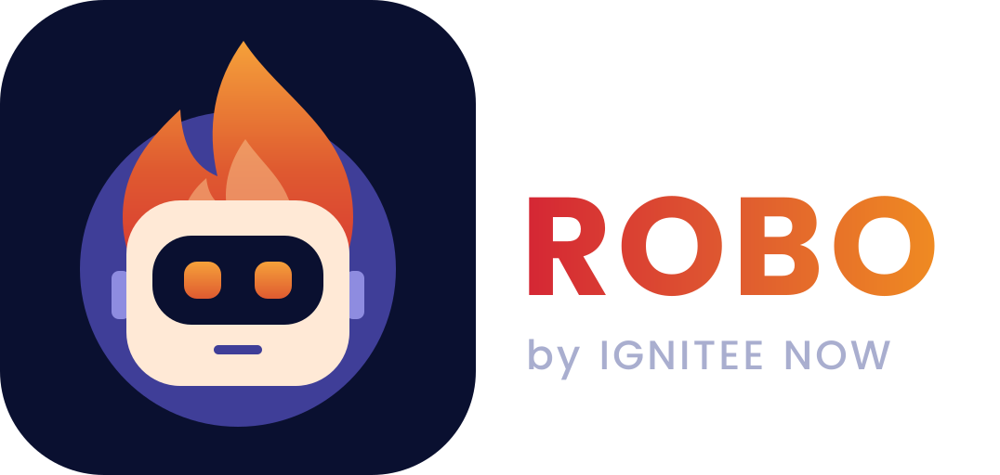

<div align="center">



**A free, open-source AI agent that runs on your own computer.**

Talk to it or type to it. Robo reads your files, browses the web, writes and
runs code, and carries a task from start to finish, in your terminal, in a
desktop app, or in your browser.

[Install](#install) · [Run it](#run-it) · [What it does](#what-robo-does) · [Make it yours](#make-it-yours)

</div>

---

## What Robo is

Robo is a personal AI agent for anyone: developers, writers, students,
researchers, IT and security teams, small businesses. You connect the AI model
you prefer (OpenAI, Anthropic, DeepSeek, Kimi, OpenRouter, or a local model
through Ollama), and Robo adds the tools, memory, voice, and safety checks.

Your data stays on your machine, under `~/.robo`.

## What Robo does

- **Talks and listens.** Hands-free wake word ("Hey Roh Boh"), voice input, and
  spoken replies. Transcription runs locally by default.
- **Reads files of any size.** PDFs, Word docs, spreadsheets, codebases, and huge
  logs. Robo indexes them locally and answers with exact quotes.
- **Gets real work done.** Coding, research, writing, data work, file cleanup,
  system admin, and security analysis. It runs terminal commands, edits files,
  uses a real browser, and executes code, asking you first before anything risky.
- **Remembers.** Memory across sessions, searchable history, and reusable skills.
- **Automates.** Scheduled jobs, parallel sub-agents, and messaging bots
  (Telegram, Discord, Slack, and more).

## Install

**Linux · macOS · WSL**

```bash
git clone https://github.com/igniteenow/robo.git
cd robo
bash install-robo.sh
robo model        # pick a model and add its API key
```

On Debian/Ubuntu, voice input also needs `sudo apt install libportaudio2`.

**Windows (PowerShell)**

```powershell
git clone https://github.com/igniteenow/robo.git
cd robo
Set-ExecutionPolicy -Scope Process Bypass
.\install-robo.ps1
robo model
```

The installer sets up Python, Node, and the voice stack. It never overwrites
your existing config, memory, or skills. Run `robo doctor` at any time to see
what's missing.
For scripted installs, call `scripts/install.sh` or `scripts/install.ps1`
directly.

## Run it

Pick the way you like to work. All of them share the same sessions, memory, and
settings.

### 1. Terminal (TUI)

```bash
robo              # full-screen terminal interface
robo --cli        # classic line-by-line prompt
robo chat -q "Summarize README.md"   # one question, one answer, no UI
```

### 2. Desktop app

```bash
robo desktop      # builds (first run only) and opens the desktop app
```

It works on Windows, macOS, and Linux. After the first build it opens straight
away.

### 3. Browser (localhost)

```bash
robo dashboard    # opens http://localhost:9119
```

This gives you chat, settings, API keys, sessions, logs, skills, and MCP servers
in any browser. Useful flags: `--port 8080`, `--no-open`, `--stop`, `--status`.

**Open it from another device (phone, laptop, server):** set a login in
`~/.robo/.env`, then bind to your network:

```bash
ROBO_DASHBOARD_BASIC_AUTH_USERNAME=admin
ROBO_DASHBOARD_BASIC_AUTH_PASSWORD=choose-a-strong-password
ROBO_DASHBOARD_BASIC_AUTH_SECRET=<output of: openssl rand -base64 32>
```

```bash
robo dashboard --host 0.0.0.0 --no-open    # then visit http://<this-machine-ip>:9119
```

Robo refuses to start on a network address without a login. You can also point
the desktop app at this address (Settings → Gateway → Remote gateway) to use a Robo that
runs on another machine.

### 4. HTTP API (OpenAI-compatible)

Use Robo from your own apps, scripts, or chat frontends such as Open WebUI.
Add this to `~/.robo/.env`:

```bash
API_SERVER_ENABLED=true
API_SERVER_KEY=change-me
```

```bash
robo gateway      # serves http://localhost:8642/v1
```

```bash
curl http://localhost:8642/v1/chat/completions \
  -H "Authorization: Bearer change-me" \
  -H "Content-Type: application/json" \
  -d '{"model": "robo-engineer", "messages": [{"role": "user", "content": "Hello!"}]}'
```

### 5. Docker

```bash
ROBO_UID=$(id -u) ROBO_GID=$(id -g) docker compose up -d
```

This runs the gateway and the dashboard at `http://localhost:9119`, with your
data in `~/.robo`.

## Everyday commands

| Command / key | What it does |
|---|---|
| `robo model` | Switch model or provider |
| `robo doctor` | Check your setup |
| `robo update` | Update Robo |
| `/help` | List all commands inside a chat |
| `/attach <file>` | Add a document to Robo's knowledge base (TUI) |
| `/voice on` · `/wake on` | Turn on voice chat · the "Hey Roh Boh" wake word |
| `/edit` | Take back your last message and rewrite it (TUI) |

While Robo is working you can just type: your message redirects the task that
is already running.

## Make it yours

Everything is plain files in `~/.robo/`, which you can edit, back up, or copy
to another computer:

- **`SOUL.md`**: Robo's personality and rules (tone, how careful it is, house
  style).
- **`USER.md`**: facts about you, so you don't repeat yourself.
- **`MEMORY.md`**: what Robo has learned. It updates on its own, and you can
  also say "remember that…".
- **`skills/`**: reusable procedures. Say "save this as a skill", or run
  `robo skills create <name>`.

## Safety

Before anything consequential, such as deleting files, running a destructive
command, or touching a live system, Robo asks: **Allow once**, **Allow for this
session**, or **Deny**. Every command and result stays visible.

## Status

Version 3.0.1 is a source release. Voice, GPU, and audio behavior depend on
your hardware, so run `robo doctor` after installing.

## License

[MIT](LICENSE) · Built by [Ignitee Now](https://igniteenow.com).

<sub>Based on the MIT-licensed [Hermes Agent](https://github.com/NousResearch/hermes-agent) by Nous Research. See [THIRD_PARTY_NOTICES.md](THIRD_PARTY_NOTICES.md).</sub>
